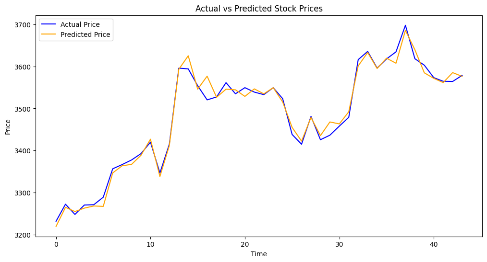

# 📈 Stock Market Price Prediction using Machine Learning

## 🔍 Project Overview
This project predicts the next-day closing price of a stock using historical market data and machine learning techniques.  
It demonstrates a complete end-to-end ML workflow with time-series awareness.

---

## 🧠 Problem Statement
To predict the next trading day's closing price using past stock market data such as Open, High, Low, Volume, and Moving Averages.

---

## 📊 Dataset
- Source: Yahoo Finance (via yfinance)
- Features:
  - Open
  - High
  - Low
  - Volume
  - MA_10 (10-day Moving Average)
  - MA_50 (50-day Moving Average)

---

## ⚙️ Technologies Used
- Python
- Pandas
- NumPy
- Matplotlib
- Scikit-learn
- yfinance
- Google Colab

---

## 🤖 Machine Learning Model
- Linear Regression (Time-Series Regression)

---

## 📈 Model Evaluation
- MAE (Mean Absolute Error)
- MSE (Mean Squared Error)
- RMSE (Root Mean Squared Error)

---

## 🔮 Result
The model successfully captures the general trend of stock prices and predicts the next-day closing price based on historical patterns.
## 📊 Project Output



**Model Evaluation:**
- MAE: 31.45
- RMSE: 42.20

**Next Day Predicted Price:**
₹3215.55

---
## 🛠️ Setup & Installation

This project is designed to run in **Google Colab**.

---

### 🔹 Run in Google Colab

1. Open Google Colab  
   👉 https://colab.research.google.com

2. Open the notebook from GitHub  
   - Navigate to `stock_prediction.ipynb`  
   - Click **Open in Colab** (or upload the file manually)

3. Install required dependency (if not already available):
   ```python
   !pip install yfinance

Runtime → Run all

---

## ⚠️ Disclaimer
This project is for educational purposes only and does not provide financial or investment advice.
## 📄 License
This project is licensed under the MIT License.
---

## 👨‍💻 Author
**Sateesh Kumar Patlegar**

💼 Open to data science, analytics, and quant roles

📧 Email: patlegarsateeshkumar@gmail.com

🔗 LinkedIn: https://www.linkedin.com/in/patlegar-sateesh-kumar-868870258/
